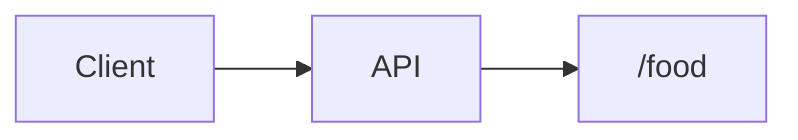

# 요구사항
맛집 검색(네이버,카카오 API)
인기키워드
 
# 작업내용
키워드를 이용해 맛집검색

# ERD

# 테스트
없는 검색 키워드가 검색되는 케이스  
있는 검색 키워드가 검색되는 케이스 
존재하는 검색어가 검색되는 케이스 
존재하는 키워드가 동시에 검색되는 케이스 

이미지 태그하고 ECR로 푸시하기에서 get-login API의 경우, aws-cli-v2 에서
get-login-password API로 변경되었슴
# 기존
$ aws ecr get-login --no-include-email --region ap-northeast-2
# 변경
$ aws ecr get-login-password --region ap-northeast-2 | docker login --username AWS --password-stdin <ACCOUNT_ID>.dkr.ecr.ap-northeast-2.amazonaws.com/

 
