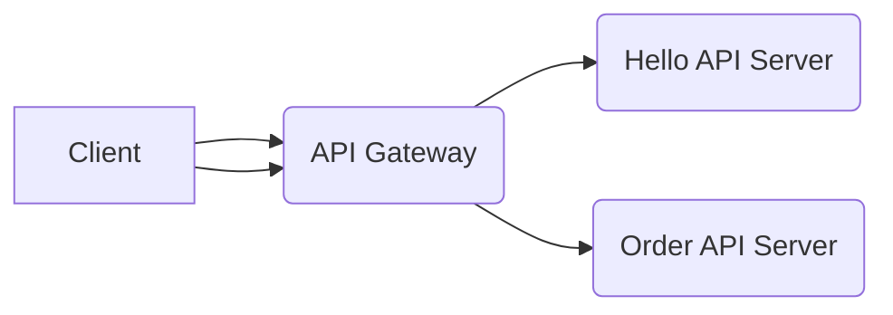

# api

# 활용기술] 
자바17   
스프링부트3.2  
mariadb  
spring-data-jpa  

[ERD]  

# 작업내용
검색, 맛집, 크롤링 API 
네이버API, 카카오 API 

# 테스트

# 참고사항

```mermaid
flowchart LR
Client --> G1(API Gateway) --> M1(Hello API Server)
Client --> G1(API Gateway) --> M2(Order API Server)
```